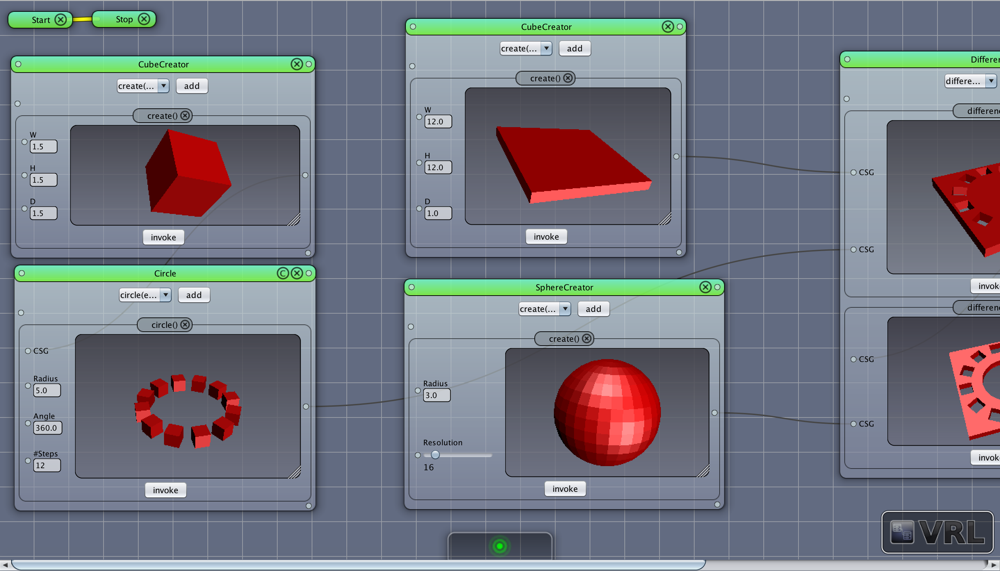
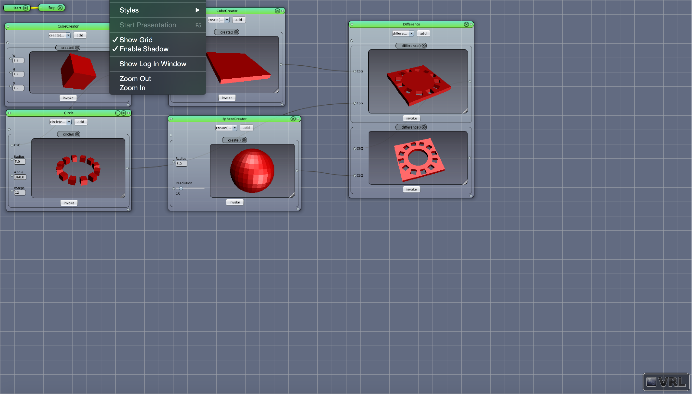

# VRL-Zoom Plugin

This project demonstrates how to create a simple [VRL](http://vrl-studio.mihosoft.eu) zoom plugin.

Webpage: http://vrl-studio.mihosoft.eu

Join the [Developer Group](https://groups.google.com/forum/#!forum/vrl-developers) if you'd like to contribute.

## How To Build The Project

### 1. Dependencies

- JDK = 1.8
- VRL >= 0.4.3
- Internet Connection (other dependencies will be downloaded automatically)
- Optional: IDE with [Gradle](http://www.gradle.org/) support

### 2. Configuration

Specify correct path in `build.properties`, e.g.,
    
    # vrl property folder location (plugin destination)
    vrldir=/Users/myusername/.vrl/0.4.3/default

### 3. Build & Install

#### IDE

To build the project from an IDE do the following:

- open the  [Gradle](http://www.gradle.org/) project
- call the `installVRLPlugin` Gradle task to build and install the plugin
- restart VRL-Studio

#### Command Line

Building the project from the command line is also possible.

Navigate to the project folder and call the `installVRLPlugin` [Gradle](http://www.gradle.org/)
task to build and install the plugin.

##### Bash (Linux/OS X/Cygwin/other Unix-like OS)

    cd Path/To/VRL-Zoom/VRL-Zoom
    ./gradlew installVRLPlugin
    
##### Windows (CMD)

    cd Path\To\VRL-Zoom\VRL-Zoom
    gradlew installVRLPlugin

Finally, restart VRL-Studio

